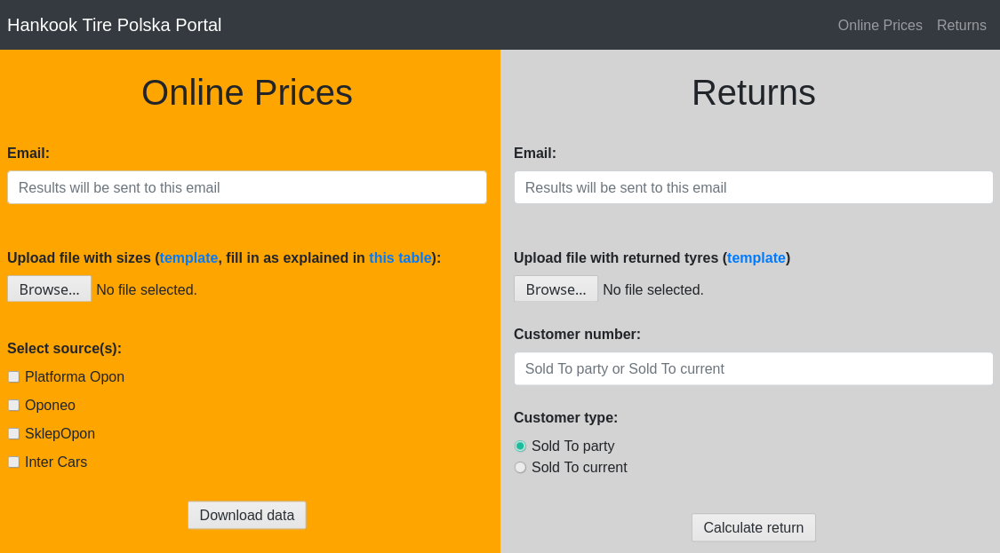

# Internal web server to interface with Python scripts
Web server that is run on a local network to enable easy access to Python scripts:
* [Tyre Price Scraping](https://github.com/fridgelord/tyre-price-scraping)
* [Returns](https://github.com/fridgelord/HK-returns)
## Setting up
Clone this repository and in root insert two directories:
* `tyre_price_scraping`
* `returns`

cloning the corresponding repository to each of the directories.

In root create a `server.txt` file with the information where you wish to set
up the server:
``` 
server_address
port
```

You will also need `credentals.txt` file in root to be able to send email to users of the server with info:
```
imap_server
port
login
password
```

## Usage
In your browser go to address set up in `server.txt` and follow instructions on
the website:


